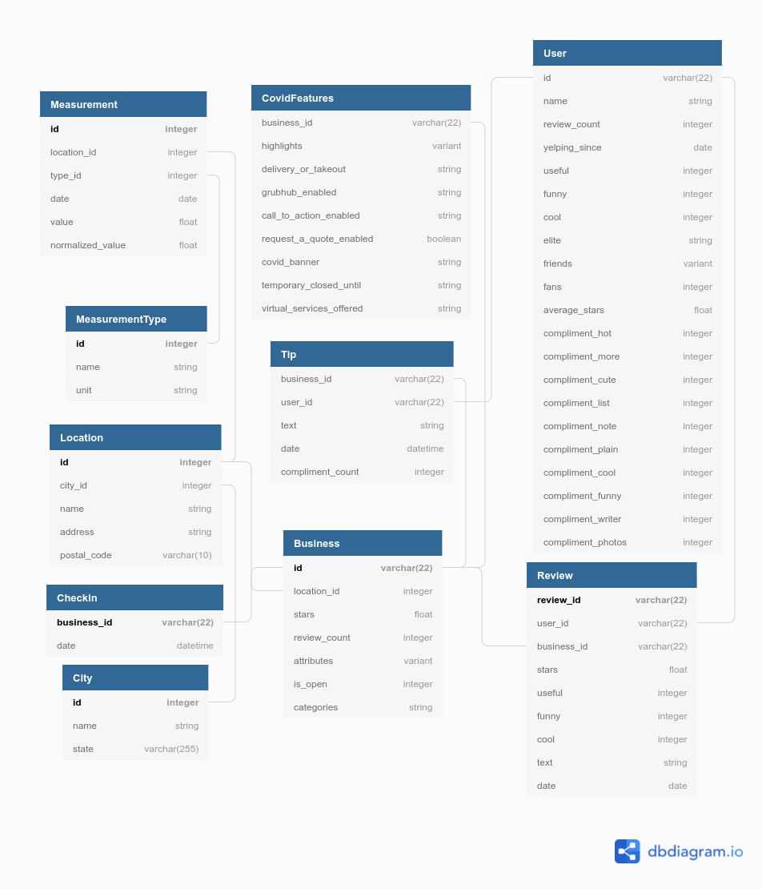

rea# Final Project for Designing Data Systems: Weather and Restaurants

## Instructions

Note: You will be creating and saving several documents, as well as taking numerous screenshots as evidence of completion. Keep track of the files.

   * Create a data architecture diagram to visualize how you will ingest and migrate the data into Staging, Operational Data Store (ODS), and Data Warehouse environments, so as to ultimately query the data for relationships between weather and Yelp reviews. Save this so it can be included in your final submission.
   * Create a staging environment(schema) in Snowflake.
   * Upload all Yelp and Climate data to the staging environment. (Screenshots 1,2) (see Screenshot description below)
      * NOTE: You may need to SPLIT these datasets into several smaller files (< 3 million records per file in YELP)
   * Create an ODS environment(aka schema).
   * Draw an entity-relationship (ER) diagram to visualize the data structure. Save this so it can be included in your final submission.
   * Migrate the data into the ODS environment. (Screenshots 3,4,5,6)
   * Draw a STAR schema for the Data Warehouse environment. Save this so it can be included in your final submission.
   * Migrate the data to the Data Warehouse. (Screenshot 7)
   * Query the Data Warehouse to determine how weather affects Yelp reviews. ( Screenshot 8)

Description of screenshots needed for submission

   * Screenshot of 6 tables created upon upload of YELP data
   * Screenshot of 2 tables created upon upload of climate data
   * SQL queries code that transforms staging to ODS. (include all queries)
   * SQL queries code that specifically uses JSON functions to transform data from a single JSON structure of staging to multiple columns of ODS. (can be similar to #3, but must include JSON functions)
   * Screenshot of the table with three columns: raw files, staging, and ODS. (and sizes)
   * SQL queries code to integrate climate and Yelp data
   * SQL queries code necessary to move the data from ODS to DWH.
   * SQL queries code that reports the business name, temperature, precipitation, and ratings.

## Rubric

The following criteria will be taken into consideration for the *staging*, *ODS* and *DWH* phases.

### Staging

|                                                           Criteria                                                            |                                                                       Meets Specifications                                                                       |
|:-----------------------------------------------------------------------------------------------------------------------------:|:----------------------------------------------------------------------------------------------------------------------------------------------------------------:|
| Students will be able to (SWBAT) load local data files into a Snowflake staging schema, using the command-line snowsql tool.  | Student  provides a screenshot after extracting 6 Yelp files into staging  schema. The screenshot should have 6 tables with the correct respective  row counts.  |
| SWBAT load data files smaller than 50 MB into Snowflake using browser.                                                        | Student  provides a screenshot after extracting 2 files into the staging schema.  The screenshot should have two tables - temperature and precipitation.         |
| SWBAT create a data architecture diagram showing the data files to stage to ODS to DWH to reporting.                          | The student provides a diagram showing 8 files pointing to staging database to ODS to DWH to Reporting.                                                          |

### Operational Data Store (ODS)

|                                      Criteria                                      |                                                                                                    Meets Specifications                                                                                                   |
|:----------------------------------------------------------------------------------:|:-------------------------------------------------------------------------------------------------------------------------------------------------------------------------------------------------------------------------:|
| SWBAT use snowsql to transform data from staging to ODS.                           | Student provides SQL queries that transform staging to ODS.                                                                                                                                                               |
| SWBAT expand and spread  JSON data into individual columns.                        | Student  provides SQL queries that use JSON functions to transform staging data  from a single JSON structure into multiple columns for ODS.                                                                              |
| SWBAT calculate and compare data compression between raw files, staging, and ODS.  | Student  provides screenshot of a table with three columns: raw files, staging,  and ODS. Each column should record the size of the data in the  respective format. The table should have eight rows, one for each file.  |
| SWBAT reverse engineer data sets into an entity relationship model.                | The student provides an ER diagram that includes all appropriate model information.                                                                                                                                       |
| SWBAT integrate climate and Yelp data sets by identifying a common data field.     | Submission should include a SQL query that show how the datasets are integrated.                                                                                                                                          |


### Datawarehouse (DWH)

|                                      Criteria                                      |                                                                                                    Meets Specifications                                                                                                   |
|:----------------------------------------------------------------------------------:|:-------------------------------------------------------------------------------------------------------------------------------------------------------------------------------------------------------------------------:|
| SWBAT use snowsql to transform data from staging to ODS.                           | Student provides SQL queries that transform staging to ODS.                                                                                                                                                               |
| SWBAT expand and spread  JSON data into individual columns.                        | Student  provides SQL queries that use JSON functions to transform staging data  from a single JSON structure into multiple columns for ODS.                                                                              |
| SWBAT calculate and compare data compression between raw files, staging, and ODS.  | Student  provides screenshot of a table with three columns: raw files, staging,  and ODS. Each column should record the size of the data in the  respective format. The table should have eight rows, one for each file.  |
| SWBAT reverse engineer data sets into an entity relationship model.                | The student provides an ER diagram that includes all appropriate model information.                                                                                                                                       |
| SWBAT integrate climate and Yelp data sets by identifying a common data field.     | Submission should include a SQL query that show how the datasets are integrated.                                                                                                                                          |


### Suggestion for making the project stand out

1. Load the data into MySQL. Compare the loading times and storage sizes of MySQL and Snowflake.
2. Create a dashboard using any popular visualization tool, such as Power BI or Tableau.


## Staging Load Rubric Steps

Firstly create the DATABASE and SCHEMA:

```sql
CREATE OR REPLACE DATABASE WEATHER_RESTAURANTS;
CREATE ORREPLACE SCHEMA STAGING;
```

### Loading the YELP DATA (6 JSONs)

For each of the 6 JSONS, here are the sql codes and results.

### Business

```sql
use DATABASE WEATHER_RESTAURANTS;
use SCHEMA STAGING;

create or replace file format MY_JSON_FORMAT type = 'JSON' strip_outer_array=true;
create or replace stage MY_JSON_STAGE file_format = MY_JSON_FORMAT;

put file:////home/andre/work/data_architect/weather_restaurants/data/raw/yelp_dataset/yelp_academic_dataset_business.json @MY_JSON_STAGE auto_compress=true;


create table Business(id VARCHAR(22), name STRING, address STRING, city STRING, state VARCHAR(255), postal_code VARCHAR(10), stars FLOAT, review_count INTEGER, attributes VARIANT, is_open INTEGER, categories STRING);


COPY INTO Business(id, name, address, city, state, postal_code, stars, review_count, attributes, is_open, categories)
   FROM (SELECT parse_json($1):business_id, parse_json($1):name, parse_json($1):address, parse_json($1):city, 
                parse_json($1):state, parse_json($1):postal_code, parse_json($1):stars,
                parse_json($1):review_count, parse_json($1):attributes, 
                parse_json($1):is_open, parse_json($1):categories
         FROM @MY_JSON_STAGE/yelp_academic_dataset_business.json.gz t)
   ON_ERROR = 'continue';
```   
   
##### Load results
```
+------------------------------------------------------+--------+-------------+-------------+-------------+-------------+-------------+------------------+-----------------------+-------------------------+
| file                                                 | status | rows_parsed | rows_loaded | error_limit | errors_seen | first_error | first_error_line | first_error_character | first_error_column_name |
|------------------------------------------------------+--------+-------------+-------------+-------------+-------------+-------------+------------------+-----------------------+-------------------------|
| my_json_stage/yelp_academic_dataset_business.json.gz | LOADED |      160585 |      160585 |      160585 |           0 | NULL        |             NULL |                  NULL | NULL                    |
+------------------------------------------------------+--------+-------------+-------------+-------------+-------------+-------------+------------------+-----------------------+-------------------------+
1 Row(s) produced. Time Elapsed: 7.473s
```


#### Checkin

```sql
use DATABASE WEATHER_RESTAURANTS;
use SCHEMA STAGING;

create or replace file format MY_JSON_FORMAT type = 'JSON' strip_outer_array=true;
create or replace stage MY_JSON_STAGE file_format = MY_JSON_FORMAT;

put file:////home/andre/work/data_architect/weather_restaurants/data/raw/yelp_dataset/yelp_academic_dataset_checkin.json 
   @MY_JSON_STAGE auto_compress=true;


CREATE OR REPLACE TABLE Checkin(business_id VARCHAR(22), date STRING);

COPY INTO Checkin(business_id, date)
   FROM (SELECT parse_json($1):business_id, parse_json($1):date
         FROM @MY_JSON_STAGE/yelp_academic_dataset_checkin.json.gz t)
   ON_ERROR = 'continue';
```

``
##### Load results
```
+-----------------------------------------------------+--------+-------------+-------------+-------------+-------------+-------------+------------------+-----------------------+-------------------------+
| file                                                | status | rows_parsed | rows_loaded | error_limit | errors_seen | first_error | first_error_line | first_error_character | first_error_column_name |
|-----------------------------------------------------+--------+-------------+-------------+-------------+-------------+-------------+------------------+-----------------------+-------------------------|
| my_json_stage/yelp_academic_dataset_checkin.json.gz | LOADED |      138876 |      138876 |           1 |           0 | NULL        |             NULL |                  NULL | NULL                    |
+-----------------------------------------------------+--------+-------------+-------------+-------------+-------------+-------------+------------------+-----------------------+-------------------------+
```

#### Tip

```sql
use DATABASE WEATHER_RESTAURANTS;
use SCHEMA STAGING;

create or replace file format MY_JSON_FORMAT type = 'JSON' strip_outer_array=true;
create or replace stage MY_JSON_STAGE file_format = MY_JSON_FORMAT;

create table Tip(user_id VARCHAR(22), business_id VARCHAR(22), text STRING, date_time STRING, compliment_count INTEGER);

COPY INTO Tip(user_id , business_id , text, date_time, compliment_count)
    FROM (SELECT parse_json($1):user_id, parse_json($1):business_id, parse_json($1):text, parse_json($1):date, parse_json($1):compliment_count
         FROM @MY_JSON_STAGE/yelp_academic_dataset_tip.json.gz t)
    ON_ERROR = 'continue';
```

##### Load results

```
+-------------------------------------------------+--------+-------------+-------------+-------------+-------------+-------------+------------------+-----------------------+-------------------------+
| file                                            | status | rows_parsed | rows_loaded | error_limit | errors_seen | first_error | first_error_line | first_error_character | first_error_column_name |
|-------------------------------------------------+--------+-------------+-------------+-------------+-------------+-------------+------------------+-----------------------+-------------------------|
| my_json_stage/yelp_academic_dataset_tip.json.gz | LOADED |     1162119 |     1162119 |     1162119 |           0 | NULL        |             NULL |                  NULL | NULL                    |
+-------------------------------------------------+--------+-------------+-------------+-------------+-------------+-------------+------------------+-----------------------+-------------------------+
1 Row(s) produced. Time Elapsed: 16.816s

```

#### User

```sql
use DATABASE WEATHER_RESTAURANTS;
use SCHEMA STAGING;

CREATE OR REPLACE TABLEfile format MY_JSON_FORMAT type = 'JSON' strip_outer_array=true;
CREATE OR REPLACE TABLE stage MY_JSON_STAGE file_format = MY_JSON_FORMAT;

CREATE OR REPLACE TABLE User(user_id VARCHAR(22), name STRING, review_count INTEGER, yelping_since DATE, useful INTEGER, funny INTEGER, cool INTEGER, elite STRING, friends VARIANT, fans INTEGER, average_stars FLOAT, compliment_hot INTEGER, compliment_more INTEGER, compliment_profile INTEGER, compliment_cute INTEGER, compliment_list INTEGER, compliment_note INTEGER, compliment_plain INTEGER, compliment_cool INTEGER, compliment_funny INTEGER, compliment_writer INTEGER, compliment_photos INTEGER);


COPY INTO User(user_id, name, review_count, yelping_since, useful, funny, cool, elite, friends, fans, average_stars, compliment_hot, compliment_more, compliment_profile, compliment_cute, compliment_list, compliment_note, compliment_plain, compliment_cool, compliment_funny, compliment_writer, compliment_photos)
    FROM (SELECT parse_json($1):user_id, parse_json($1):name, parse_json($1):review_count, parse_json($1):yelping_since, parse_json($1):useful,
        parse_json($1):funny, parse_json($1):cool, parse_json($1):elite, parse_json($1):friends, parse_json($1):fans,
        parse_json($1):average_stars, parse_json($1):compliment_hot, parse_json($1):compliment_more, parse_json($1):compliment_profile, parse_json($1):compliment_cute,
        parse_json($1):compliment_list, parse_json($1):compliment_note, parse_json($1):compliment_plain, parse_json($1):compliment_cool, parse_json($1):compliment_funny,
        parse_json($1):compliment_writer, parse_json($1):compliment_photos
        FROM @MY_JSON_STAGE/yelp_academic_dataset_user.json.gz t)
    ON_ERROR = 'continue';
```

##### Load results

```
+--------------------------------------------------+--------+-------------+-------------+-------------+-------------+-------------+------------------+-----------------------+-------------------------+
| file                                             | status | rows_parsed | rows_loaded | error_limit | errors_seen | first_error | first_error_line | first_error_character | first_error_column_name |
|--------------------------------------------------+--------+-------------+-------------+-------------+-------------+-------------+------------------+-----------------------+-------------------------|
| my_json_stage/yelp_academic_dataset_user.json.gz | LOADED |     2189457 |     2189457 |     2189457 |           0 | NULL        |             NULL |                  NULL | NULL                    |
+--------------------------------------------------+--------+-------------+-------------+-------------+-------------+-------------+------------------+-----------------------+-------------------------+
1 Row(s) produced. Time Elapsed: 198.861s
```


#### Review 
```sql
use DATABASE WEATHER_RESTAURANTS;
use SCHEMA STAGING;

create or replace file format MY_JSON_FORMAT type = 'JSON' strip_outer_array=true;
create or replace stage MY_JSON_STAGE file_format = MY_JSON_FORMAT;

create table Review(review_id VARCHAR(22), user_id VARCHAR(22), business_id VARCHAR(22), stars FLOAT, useful INTEGER, funny INTEGER, cool INTEGER, text STRING, date DATE);

COPY INTO Review(review_id, user_id, business_id, stars, useful, funny, cool, text, date)
    FROM (SELECT parse_json($1):review_id, parse_json($1):user_id, parse_json($1):business_id, parse_json($1):stars, parse_json($1):useful,
        parse_json($1):funny, parse_json($1):cool, parse_json($1):text, parse_json($1):date
        FROM @MY_JSON_STAGE/yelp_academic_dataset_review.json.gz t)
    ON_ERROR = 'continue';
```

##### Load results

```
+----------------------------------------------------+--------+-------------+-------------+-------------+-------------+-------------+------------------+-----------------------+-------------------------+
| file                                               | status | rows_parsed | rows_loaded | error_limit | errors_seen | first_error | first_error_line | first_error_character | first_error_column_name |
|----------------------------------------------------+--------+-------------+-------------+-------------+-------------+-------------+------------------+-----------------------+-------------------------|
| my_json_stage/yelp_academic_dataset_review.json.gz | LOADED |     8635403 |     8635403 |     8635403 |           0 | NULL        |             NULL |                  NULL | NULL                    |
+----------------------------------------------------+--------+-------------+-------------+-------------+-------------+-------------+------------------+-----------------------+-------------------------+
1 Row(s) produced. Time Elapsed: 260.512s
```

#### Covid Features

```sql
use DATABASE WEATHER_RESTAURANTS;
use SCHEMA STAGING;

CREATE OR REPLACE TABLE CovidFeatures(business_id VARCHAR(22), highlights VARIANT, delivery_or_takeout STRING, grubhub_enabled STRING, call_to_action_enabled STRING, request_a_quote_enabled BOOLEAN, covid_banner STRING, temporary_closed_until STRING, virtual_services_offered STRING);

COPY INTO CovidFeatures(business_id, highlights, delivery_or_takeout, grubhub_enabled, call_to_action_enabled, request_a_quote_enabled, covid_banner, temporary_closed_until, virtual_services_offered)
    FROM (SELECT parse_json($1):business_id, parse_json($1):highlights, parse_json($1):"delivery or takeout", parse_json($1):"Grubhub enabled", parse_json($1):"Call To Action enabled",
        parse_json($1):"Request a Quote Enabled", parse_json($1):"Covid Banner", parse_json($1):"Temporary Closed Until", parse_json($1):"Virtual Services Offered"
        FROM @MY_JSON_STAGE/yelp_academic_dataset_covid_features.json.gz t)
    ON_ERROR = 'continue';
```

##### Load results

```
+------------------------------------------------------------+--------+-------------+-------------+-------------+-------------+-------------+------------------+-----------------------+-------------------------+
| file                                                       | status | rows_parsed | rows_loaded | error_limit | errors_seen | first_error | first_error_line | first_error_character | first_error_column_name |
|------------------------------------------------------------+--------+-------------+-------------+-------------+-------------+-------------+------------------+-----------------------+-------------------------|
| my_json_stage/yelp_academic_dataset_covid_features.json.gz | LOADED |      209795 |      209795 |      209795 |           0 | NULL        |             NULL |                  NULL | NULL                    |
+------------------------------------------------------------+--------+-------------+-------------+-------------+-------------+-------------+------------------+-----------------------+-------------------------+
1 Row(s) produced. Time Elapsed: 4.498s
```

## Operational Data Store (ODS) Rubric Steps

### Staging Architecture Diagram (dbdiagram.io)



### Load Weather Data into Staging

```sql
use DATABASE WEATHER_RESTAURANTS;
use SCHEMA STAGING;

CREATE OR REPLACE FILE FORMAT CSV_WITH_HEADER COMPRESSION = 'AUTO' FIELD_DELIMITER = ',' RECORD_DELIMITER = '\n' SKIP_HEADER = 1 FIELD_OPTIONALLY_ENCLOSED_BY = '\047' TRIM_SPACE = FALSE ERROR_ON_COLUMN_COUNT_MISMATCH = TRUE ESCAPE = 'NONE' ESCAPE_UNENCLOSED_FIELD = '\134' DATE_FORMAT = 'YYYYMMDD' TIMESTAMP_FORMAT = 'AUTO' NULL_IF = ('\\N');
CREATE OR REPLACE stage MY_CSV_STAGE FILE_FORMAT = CSV_WITH_HEADER;

CREATE OR REPLACE TABLE Precipitation_Per_Inch(date date, precipitation float, precipitation_normalized float);

CREATE OR REPLACE TABLE Temperature_DegreeF(date date, max float, min float, normal_max float, normal_min float);
```

### Precipitation (CSV)

Sample of CSV:

```
date,precipitation,precipitation_normal
19421017,0.20,28.09
19421018,0.91,28.25
19421019,0.92,28.41
19421020,0.92,28.58
19421021,0.92,28.74
19421022,0.92,28.91
19421023,0.92,29.07
19421024,0.92,29.23
19421025,0.92,29.39
...
```

#### Loading

```sql
put file:////home/andre/work/data_architect/weather_restaurants/data/raw/USW00013904-AUSTIN_BERGSTROM_INTL_AP/USW00013904-AUSTIN_BERGSTROM_INTL_AP-precipitation-inch.csv @MY_CSV_STAGE auto_compress=true;

COPY INTO PRECIPITATION_PER_INCH
   FROM @MY_CSV_STAGE/USW00013904-AUSTIN_BERGSTROM_INTL_AP-precipitation-inch.csv.gz
   FILE_FORMAT = (format_name = CSV_WITH_HEADER) on_error = 'skip_file';
```

```
+-----------------------------------------------------------------------------+--------+-------------+-------------+-------------+-------------+-------------+------------------+-----------------------+-------------------------+
| file                                                                        | status | rows_parsed | rows_loaded | error_limit | errors_seen | first_error | first_error_line | first_error_character | first_error_column_name |
|-----------------------------------------------------------------------------+--------+-------------+-------------+-------------+-------------+-------------+------------------+-----------------------+-------------------------|
| my_csv_stage/USW00013904-AUSTIN_BERGSTROM_INTL_AP-precipitation-inch.csv.gz | LOADED |       30392 |       30392 |           1 |           0 | NULL        |             NULL |                  NULL | NULL                    |
+-----------------------------------------------------------------------------+--------+-------------+-------------+-------------+-------------+-------------+------------------+-----------------------+-------------------------+
1 Row(s) produced. Time Elapsed: 1.228s

```

### Temperature (CSV)

The following is contains some rows for the temperature set:

```
date,min,max,normal_min,normal_max
19421017,70.0,66.0,82.4,56.8
19421018,70.0,63.0,82.0,56.5
19421019,75.0,58.0,81.6,56.1
19421020,78.0,59.0,81.3,55.7
19421021,83.0,58.0,80.9,55.4
19421022,87.0,55.0,80.5,55.0
19421023,79.0,52.0,80.2,54.6
19421024,68.0,55.0,79.8,54.3
19421025,81.0,63.0,79.4,53.9
...
```

One problem that was detected, was that the min and max fields are inverted. This could be easily switched over while loading the dataset. 

#### Loading

```sql
put file:////home/andre/work/data_architect/weather_restaurants/data/raw/USW00013904-AUSTIN_BERGSTROM_INTL_AP/USW00013904-temperature-degreeF.csv @MY_CSV_STAGE auto_compress=true;

COPY INTO Temperature_DegreeF
   FROM @MY_CSV_STAGE/USW00013904-temperature-degreeF.csv.gz
   FILE_FORMAT = (format_name = CSV_WITH_HEADER) on_error = 'skip_file';
```

```
+-----------------------------------------------------+--------+-------------+-------------+-------------+-------------+-------------+------------------+-----------------------+-------------------------+
| file                                                | status | rows_parsed | rows_loaded | error_limit | errors_seen | first_error | first_error_line | first_error_character | first_error_column_name |
|-----------------------------------------------------+--------+-------------+-------------+-------------+-------------+-------------+------------------+-----------------------+-------------------------|
| my_csv_stage/USW00013904-temperature-degreeF.csv.gz | LOADED |       30392 |       30392 |           1 |           0 | NULL        |             NULL |                  NULL | NULL                    |
+-----------------------------------------------------+--------+-------------+-------------+-------------+-------------+-------------+------------------+-----------------------+-------------------------+
1 Row(s) produced. Time Elapsed: 0.965s

```

### Loading data into Operational Data Storage (ODS)

```sql
use DATABASE WEATHER_RESTAURANTS;
use SCHEMA ODS;

CREATE OR REPLACE TABLE City(
    id integer NOT NULL PRIMARY KEY UNIQUE AUTOINCREMENT,
    name string,
    state varchar(255)
);

INSERT INTO City(name, state)
      SELECT DISTINCT B.CITY, B.STATE
      FROM "STAGING"."BUSINESS" AS B;

CREATE OR REPLACE TABLE LOCATION(
    id integer NOT NULL PRIMARY KEY UNIQUE AUTOINCREMENT,
    city_id integer,
    name string,
    address string,
    postal_code varchar(10)
);

INSERT INTO "LOCATION"(city_id, address, postal_code) 
  SELECT C.id as city_id, B.name, B.address, B.postal_code
  FROM "WEATHER_RESTAURANTS"."STAGING"."BUSINESS" as B
  INNER JOIN CITY as C
  ON C.name = B.city AND c.state = B.state;

-- Business
CREATE OR REPLACE TABLE Business(
    id varchar(22) NOT NULL,
    location_id integer NOT NULL UNIQUE,
    stars float,
    review_count integer,
    attributes variant,
    is_open integer,
    categories string,
   
   CONSTRAINT pk_id UNIQUE PRIMARY KEY (id) enforced,
   CONSTRAINT fk_location_id  FOREIGN KEY (location_id) REFERENCES ODS.Location(id)
);

INSERT INTO BUSINESS(id, location_id, stars, review_count, attributes, is_open, categories) 
  SELECT DISTINCT 
    B.id, L.id as location_id, B.stars, B.review_count, B.attributes, B.is_open, B.categories
  FROM "WEATHER_RESTAURANTS"."STAGING"."BUSINESS" as B
  INNER JOIN Location as L
  ON L.name = B.name AND L.address = B.address and L.postal_code = B.postal_code;

-- Checkin
CREATE OR REPLACE TABLE Checkin(
    business_id varchar(22) NOT NULL PRIMARY KEY,
    date DATETIME
);

INSERT INTO Checkin(business_id, date) 
      SELECT business_id, TO_TIMESTAMP_NTZ(d.value::string) as date FROM "STAGING"."CHECKIN", lateral flatten(input=>split(date, ',')) d;

-- CovidFeatures
CREATE OR REPLACE TABLE CovidFeatures(
    business_id VARCHAR(22) NOT NULL PRIMARY KEY, 
    highlights VARIANT, 
    delivery_or_takeout STRING, 
    grubhub_enabled STRING, 
    call_to_action_enabled STRING, 
    request_a_quote_enabled BOOLEAN, 
    covid_banner STRING, 
    temporary_closed_until STRING, 
    virtual_services_offered STRING);

INSERT INTO CovidFeatures(business_id, highlights, delivery_or_takeout, grubhub_enabled, call_to_action_enabled, request_a_quote_enabled, covid_banner, temporary_closed_until, virtual_services_offered)
    SELECT *
    FROM "WEATHER_RESTAURANTS"."STAGING"."COVIDFEATURES";

-- User
CREATE OR REPLACE TABLE User(
    user_id VARCHAR(22) NOT NULL UNIQUE PRIMARY KEY, 
    name STRING, 
    review_count INTEGER, 
    yelping_since DATE, 
    useful INTEGER, 
    funny INTEGER, 
    cool INTEGER, 
    elite STRING, 
    friends VARIANT, 
    fans INTEGER, 
    average_stars FLOAT, 
    compliment_hot INTEGER, 
    compliment_more INTEGER, 
    compliment_profile INTEGER, 
    compliment_cute INTEGER, 
    compliment_list INTEGER, 
    compliment_note INTEGER, 
    compliment_plain INTEGER, 
    compliment_cool INTEGER, 
    compliment_funny INTEGER, 
    compliment_writer INTEGER, 
    compliment_photos INTEGER);

INSERT INTO User(user_id, name, review_count, yelping_since, useful, funny, cool, elite, friends, fans, average_stars, compliment_hot, compliment_more, compliment_profile, compliment_cute, compliment_list, compliment_note, compliment_plain, compliment_cool, compliment_funny, compliment_writer, compliment_photos)
    SELECT *
    FROM "WEATHER_RESTAURANTS"."STAGING"."USER";

-- Review
CREATE OR REPLACE TABLE Review(
    review_id VARCHAR(22) NOT NULL UNIQUE PRIMARY KEY, 
    user_id VARCHAR(22) NOT NULL, 
    business_id VARCHAR(22) NOT NULL, 
    stars FLOAT, 
    useful INTEGER, 
    funny INTEGER, 
    cool INTEGER, 
    text STRING, 
    date DATE);

INSERT INTO Review(review_id , user_id, business_id, stars, useful, funny, cool, text, date)
    SELECT *
    FROM "WEATHER_RESTAURANTS"."STAGING"."REVIEW";

-- Tip
CREATE OR REPLACE TABLE Tip(
    user_id VARCHAR(22) NOT NULL, 
    business_id VARCHAR(22) NOT NULL, 
    text STRING, 
    date_time DATETIME, 
    compliment_count INTEGER);
INSERT INTO Tip(user_id , business_id , text, date_time, compliment_count)
    SELECT 
      user_id, business_id, text, 
      TO_TIMESTAMP_NTZ(date_time), compliment_count
    FROM "WEATHER_RESTAURANTS"."STAGING"."TIP";


-- Measurement and MeasurementType
CREATE OR REPLACE TABLE MeasurementType(
    id integer NOT NULL PRIMARY KEY UNIQUE AUTOINCREMENT,
    name string,
    unit string
);

INSERT INTO MeasurementType(name, unit)
    VALUES
    ('max temperature', 'farenheit'),
    ('min temperature', 'farenheit'),
    ('precipitation', 'inch');

CREATE OR REPLACE TABLE Measurement(
    id INTEGER NOT NULL PRIMARY KEY UNIQUE AUTOINCREMENT,
    location_id INTEGER NOT NULL,
    type_id INTEGER NOT NULL,
    date DATE NOT NULL,
    value FLOAT,
    normalized_value FLOAT
);

INSERT INTO Measurement(location_id, type_id, date, value, normalized_value)
  SELECT L.id as location_id, T.id as type_id, M.date, M.max, M.normal_max FROM 
    (
      SELECT L.id
        FROM City AS C, Location L
        WHERE C.name = 'Austin' 
          AND C.state = 'TX' 
          AND L.name = 'Austin Bergstrom Intl Airport' 
          AND L.address = '3600 Presidential Blvd' 
          AND L.postal_code = '78719'
    ) AS L, 
    (
      SELECT id
        FROM MeasurementType
        WHERE name = 'max temperature' 
          AND unit = 'farenheit'
     ) AS T, 
     "WEATHER_RESTAURANTS"."STAGING"."TEMPERATURE_DEGREEF" as M;
     
INSERT INTO Measurement(location_id, type_id, date, value, normalized_value)
  SELECT L.id as location_id, T.id as type_id, M.date, M.min, M.normal_min FROM 
    (
      SELECT L.id
        FROM City AS C, Location L
        WHERE C.name = 'Austin' 
          AND C.state = 'TX' 
          AND L.name = 'Austin Bergstrom Intl Airport' 
          AND L.address = '3600 Presidential Blvd' 
          AND L.postal_code = '78719'
    ) AS L, 
    (
      SELECT id
        FROM MeasurementType
        WHERE name = 'min temperature' 
          AND unit = 'farenheit'
     ) AS T, 
     "WEATHER_RESTAURANTS"."STAGING"."TEMPERATURE_DEGREEF" as M;

INSERT INTO Measurement(location_id, type_id, date, value, normalized_value)
  SELECT L.id as location_id, T.id as type_id, M.date, M.precipitation, M.precipitation_normalized FROM 
    (
      SELECT L.id
        FROM City AS C, Location L
        WHERE C.name = 'Austin' 
          AND C.state = 'TX' 
          AND L.name = 'Austin Bergstrom Intl Airport' 
          AND L.address = '3600 Presidential Blvd' 
          AND L.postal_code = '78719'
    ) AS L, 
    (
      SELECT id
        FROM MeasurementType
        WHERE name = 'precipitation' 
          AND unit = 'inch'
     ) AS T, 
     "WEATHER_RESTAURANTS"."STAGING"."PRECIPITATION_PER_INCH" as M;
```

## Converting from ODS into Datawarehouse (DWH)

```sql
CREATE OR REPLACE SCHEMA DWH;
USE SCHEMA DWH;

-- REPORT THAT REPRESENTS, BUSINESS NAME TEMPERATURE PRECIPITATION RATINGS
-- Create Dimensions to extract above
CREATE OR REPLACE TABLE Dim_City(city_id INTEGER, city STRING, state VARCHAR(255));
INSERT INTO Dim_City SELECT DISTINCT id, name, state from ODS.City;

-- Location
CREATE OR REPLACE TABLE Dim_Location(
  location_id  INTEGER, 
  city_id INTEGER, 
  location_name STRING, 
  address STRING, 
  postal_code VARCHAR(10));
INSERT INTO Dim_Location SELECT DISTINCT id, city_id, name, address, postal_code from ODS.Location;

-- MeasurementType
CREATE OR REPLACE TABLE Dim_MeasurementType(
  measurement_type_id INTEGER, 
  measurement_type STRING, 
  measurement_unit STRING); 
INSERT INTO Dim_MeasurementType SELECT DISTINCT id, name, unit from ODS.MeasurementType;

-- Measurement
CREATE OR REPLACE TABLE Dim_Measurement(
  measurement_id INTEGER, 
  location_id INTEGER, 
  measurement_type_id INTEGER, 
  date DATE, 
  value FLOAT, 
  normalized_value FLOAT);
  INSERT INTO Dim_Measurement 
    SELECT DISTINCT id, location_id, type_id, date, value, normalized_value 
    FROM ODS.Measurement;
    
CREATE OR REPLACE TABLE Dim_Business(
  business_id VARCHAR(22),
  location_id INTEGER,
  business_stars FLOAT,
  business_review_count INTEGER,
  business_is_open INTEGER,
  business_categories  STRING
);
INSERT INTO Dim_Business 
    SELECT DISTINCT 
      id, location_id, stars, review_count, 
      is_open, categories 
    FROM ODS.Business;

CREATE OR REPLACE TABLE Dim_Checkin(
  business_id VARCHAR(22),
  date date,
  checkin_count INTEGER
);
INSERT INTO Dim_Checkin SELECT DISTINCT business_id, date, COUNT(*) from ODS.Checkin GROUP BY business_id, date;

CREATE OR REPLACE TABLE Dim_User(
  user_id VARCHAR(22), 
  user_name STRING, 
  user_review_count INTEGER, 
  user_average_stars FLOAT);
INSERT INTO Dim_User SELECT DISTINCT user_id, name, review_count, average_stars from ODS.User;

CREATE OR REPLACE TABLE Dim_Review(
  review_id VARCHAR(22),
  user_id VARCHAR(22),
  business_id VARCHAR(22),
  review_stars FLOAT,
  review_useful INTEGER,
  review_funny INTEGER,
  review_cool INTEGER,
  date DATE
);
INSERT INTO Dim_Review SELECT DISTINCT review_id, user_id, business_id, stars, useful, funny, cool, date FROM ODS.Review;

CREATE OR REPLACE TABLE Fact_BusinessRatings(
  -- Business
  business_id VARCHAR(22),
  business_stars FLOAT,
  business_review_count INTEGER,
  business_is_open INTEGER,
  business_categories  STRING,
  -- Location
  location_id INTEGER,
  location_name STRING, 
  address STRING, 
  postal_code VARCHAR(10),
  -- City
  city_id INTEGER, 
  city STRING, 
  state VARCHAR(255),
  -- User
  user_id VARCHAR(22), 
  user_name STRING, 
  user_review_count INTEGER,
  user_average_stars FLOAT,
  -- Review
  review_id VARCHAR(22),  
  review_stars FLOAT,
  review_date DATE,  
  -- Measurement
  measurement_id INTEGER,   
  value FLOAT, 
  normalized_value FLOAT,
  -- MeasurementType
  measurement_type_id INTEGER,
  measurement_type STRING,
  measurement_unit STRING,
  
  CONSTRAINT fk_business_id  FOREIGN KEY (business_id) REFERENCES ODS.Business(id),
  CONSTRAINT fk_location_id  FOREIGN KEY (location_id) REFERENCES ODS.Location(id),
  CONSTRAINT fk_city_id  FOREIGN KEY (city_id) REFERENCES ODS.City(id),
  CONSTRAINT fk_user_id  FOREIGN KEY (user_id) REFERENCES ODS.User(user_id),
  CONSTRAINT fk_review_id FOREIGN KEY (review_id) REFERENCES ODS.Review(review_id),
  CONSTRAINT fk_measurement_id FOREIGN KEY (measurement_id) REFERENCES ODS.Measurement(id),
  CONSTRAINT fk_measurement_type_id FOREIGN KEY (measurement_type_id) REFERENCES ODS.MeasurementType(id)
);

INSERT INTO Fact_BusinessRatings 
    SELECT 
        B.business_id, B.business_stars, B.business_review_count, B.business_is_open, B.business_categories,
        L.location_id, L.location_name, L.address, L.postal_code,
        C.city_id, C.city, C.state,
        U.user_id, U.user_name, U.user_review_count, U.user_average_stars,
        R.review_id, R.review_stars, R.date,
        M.measurement_id, M.value, M.normalized_value,
        T.measurement_type_id, T.measurement_type STRING, T.measurement_unit
    FROM
        Dim_Business B,         
        Dim_Location L,
        Dim_City C,
        Dim_User U,
        Dim_Review R,
        Dim_Measurement M,
        Dim_MeasurementType T
      WHERE 
        (B.business_id = R.business_id)
        AND (R.date = M.date)
        AND (R.user_id = U.user_id)
        AND (B.location_id = L.location_id)
        AND (C.city = 'Austin' and C.state = 'TX')
        AND (M.measurement_type_id = T.measurement_type_id);
 
 SELECT 
        B.business_id, B.business_stars, B.business_review_count, B.business_is_open, B.business_categories,
        L.location_id, L.location_name, L.address, L.postal_code,
        C.city_id, C.city, C.state,
        U.user_id, U.user_name, U.user_review_count, U.user_average_stars,
        R.review_id, R.review_stars, R.date,
        M.measurement_id, M.value, M.normalized_value,
        T.measurement_type_id, T.measurement_type STRING, T.measurement_unit
    FROM
        Dim_Business B,         
        Dim_Location L,
        Dim_City C,
        Dim_User U,
        Dim_Review R,
        Dim_Measurement M,
        Dim_MeasurementType T
      WHERE (M.date = R.date)
        AND (B.business_id = R.business_id)
        AND (C.city = 'Austin') AND (C.state = 'TX')
        AND (B.location_id = L.location_id)
        AND (R.user_id = U.user_id)
        AND (M.measurement_type_id = T.measurement_type_id);
```

### Extract BUSINESS NAME, TEMPERATURE, PRECIPITATION, RATINGS

Query to extract all values including the rubric points:

```sql
SELECT *
FROM Fact_BusinessRatings;
```

Results into the following table (only first 10 lines):

|BUSINESS_ID           |BUSINESS_STARS|BUSINESS_REVIEW_COUNT|BUSINESS_IS_OPEN|BUSINESS_CATEGORIES                                                                                                        |LOCATION_ID|LOCATION_NAME              |ADDRESS               |POSTAL_CODE|CITY_ID|CITY  |STATE|USER_ID               |USER_NAME|USER_REVIEW_COUNT|USER_AVERAGE_STARS|REVIEW_ID             |REVIEW_STARS|REVIEW_DATE|MEASUREMENT_ID|VALUE|NORMALIZED_VALUE|MEASUREMENT_TYPE_ID|MEASUREMENT_TYPE|MEASUREMENT_UNIT|
|----------------------|--------------|---------------------|----------------|---------------------------------------------------------------------------------------------------------------------------|-----------|---------------------------|----------------------|-----------|-------|------|-----|----------------------|---------|-----------------|------------------|----------------------|------------|-----------|--------------|-----|----------------|-------------------|----------------|----------------|
|P6u9VBwU20tkfEKIlmrOTA|3             |200                  |0               |Specialty Schools, Education, Ethnic Food, Cafes, Cooking Schools, Taiwanese, Restaurants, Bubble Tea, Specialty Food, Food|4721       |Patty Chen's Dumpling Room |907 Main St           |02139      |8      |Austin|TX   |O6XnPd4jGG3ZGPYTP26eZw|Kara     |52               |3.47              |98MMDHtq4ZeS5qfEEO-LXw|2           |2014-03-14 |3944          |74   |72.5            |1                  |max temperature |farenheit       |
|P6u9VBwU20tkfEKIlmrOTA|3             |200                  |0               |Specialty Schools, Education, Ethnic Food, Cafes, Cooking Schools, Taiwanese, Restaurants, Bubble Tea, Specialty Food, Food|4721       |Patty Chen's Dumpling Room |907 Main St           |02139      |8      |Austin|TX   |O6XnPd4jGG3ZGPYTP26eZw|Kara     |52               |3.47              |98MMDHtq4ZeS5qfEEO-LXw|2           |2014-03-14 |65384         |42   |48.6            |2                  |min temperature |farenheit       |
|P6u9VBwU20tkfEKIlmrOTA|3             |200                  |0               |Specialty Schools, Education, Ethnic Food, Cafes, Cooking Schools, Taiwanese, Restaurants, Bubble Tea, Specialty Food, Food|4721       |Patty Chen's Dumpling Room |907 Main St           |02139      |8      |Austin|TX   |O6XnPd4jGG3ZGPYTP26eZw|Kara     |52               |3.47              |98MMDHtq4ZeS5qfEEO-LXw|2           |2014-03-14 |126824        |2.23 |5.93            |3                  |precipitation   |inch            |
|lxEyx8m57TGtfBaSp0sTMg|4             |11                   |0               |Coffee & Tea, Restaurants, Food, Cafes, Internet Cafes, Home Services, Shared Office Spaces, Real Estate, Bagels           |74630      |Post-Office Cowork + Coffee|68 Upper Alabama St SW|30303      |8      |Austin|TX   |rE0GgCcSh_JbeZfwu3fQ7w|         |                 |                  |Vz5ip6mLRTa9DwWGuAP3HA|4           |2018-06-25 |2448          |95   |94              |1                  |max temperature |farenheit       |
|lxEyx8m57TGtfBaSp0sTMg|4             |11                   |0               |Coffee & Tea, Restaurants, Food, Cafes, Internet Cafes, Home Services, Shared Office Spaces, Real Estate, Bagels           |74630      |Post-Office Cowork + Coffee|68 Upper Alabama St SW|30303      |8      |Austin|TX   |rE0GgCcSh_JbeZfwu3fQ7w|Jon      |102              |3.56              |Vz5ip6mLRTa9DwWGuAP3HA|4           |2018-06-25 |2448          |95   |94              |1                  |max temperature |farenheit       |
|lxEyx8m57TGtfBaSp0sTMg|4             |11                   |0               |Coffee & Tea, Restaurants, Food, Cafes, Internet Cafes, Home Services, Shared Office Spaces, Real Estate, Bagels           |74630      |Post-Office Cowork + Coffee|68 Upper Alabama St SW|30303      |8      |Austin|TX   |rE0GgCcSh_JbeZfwu3fQ7w|         |                 |                  |Vz5ip6mLRTa9DwWGuAP3HA|4           |2018-06-25 |63888         |77   |72.3            |2                  |min temperature |farenheit       |
|lxEyx8m57TGtfBaSp0sTMg|4             |11                   |0               |Coffee & Tea, Restaurants, Food, Cafes, Internet Cafes, Home Services, Shared Office Spaces, Real Estate, Bagels           |74630      |Post-Office Cowork + Coffee|68 Upper Alabama St SW|30303      |8      |Austin|TX   |rE0GgCcSh_JbeZfwu3fQ7w|Jon      |102              |3.56              |Vz5ip6mLRTa9DwWGuAP3HA|4           |2018-06-25 |63888         |77   |72.3            |2                  |min temperature |farenheit       |
|lxEyx8m57TGtfBaSp0sTMg|4             |11                   |0               |Coffee & Tea, Restaurants, Food, Cafes, Internet Cafes, Home Services, Shared Office Spaces, Real Estate, Bagels           |74630      |Post-Office Cowork + Coffee|68 Upper Alabama St SW|30303      |8      |Austin|TX   |rE0GgCcSh_JbeZfwu3fQ7w|         |                 |                  |Vz5ip6mLRTa9DwWGuAP3HA|4           |2018-06-25 |125328        |12.35|17.86           |3                  |precipitation   |inch            |
|lxEyx8m57TGtfBaSp0sTMg|4             |11                   |0               |Coffee & Tea, Restaurants, Food, Cafes, Internet Cafes, Home Services, Shared Office Spaces, Real Estate, Bagels           |74630      |Post-Office Cowork + Coffee|68 Upper Alabama St SW|30303      |8      |Austin|TX   |rE0GgCcSh_JbeZfwu3fQ7w|Jon      |102              |3.56              |Vz5ip6mLRTa9DwWGuAP3HA|4           |2018-06-25 |125328        |12.35|17.86           |3                  |precipitation   |inch            |
|cXqnluUz8nXzGY4SE2kWlw|2             |124                  |1               |Discount Store, Department Stores, Drugstores, Grocery, Shopping, Electronics, Food, Mobile Phones, Fashion                |43820      |Walmart Supercenter        |710 E Ben White Blvd  |78704      |8      |Austin|TX   |Mntd12vU67GO6YWKq51dFA|Paul     |6                |3.5               |5xa8yof1hplS_e4VCYjO7g|1           |2013-06-28 |4705          |105  |94.2            |1                  |max temperature |farenheit       |
